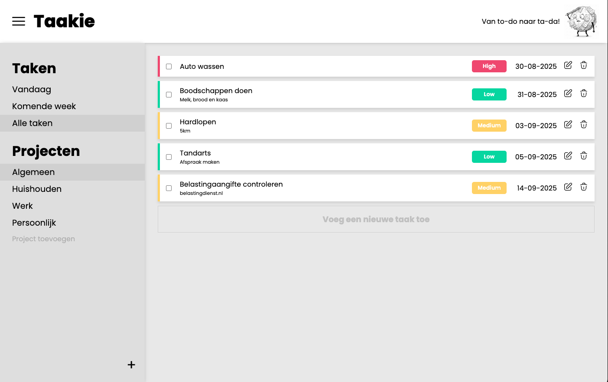

# Taakie

**Taakie** is a Dutch todo app built as part of [The Odin Project's JavaScript assignment](https://www.theodinproject.com/lessons/node-path-javascript-todo-list).  
With Taakie, you can organize your tasks by **project** and also by **week**.

Try it out: https://luukdg.github.io/ToDoApp-Taakie/

## Features

- Create and delete projects
- Add todos to specific projects (or the default one)
- Sort todos by project or by week
- View and edit task details
- Mark tasks as completed or remove them
- With the usage of `localStorage` all of your tickets and projects are stored.
